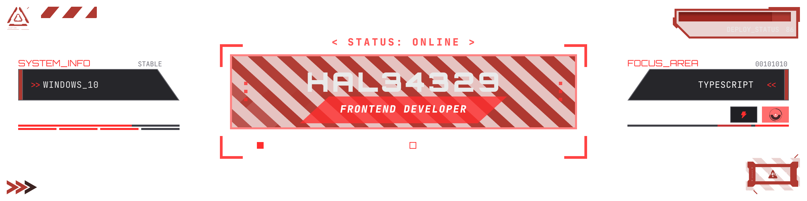
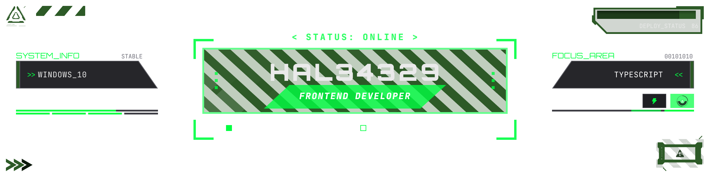
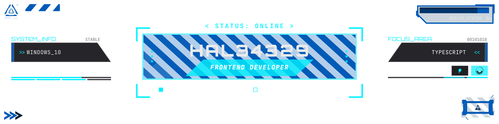
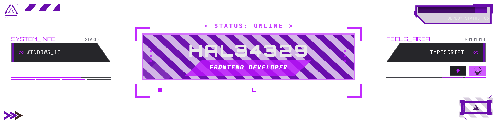

<!---




--->


```toml
[user]
name = "Jesús"
age = 27
degree = "Engineering"
role = "Frontend Developer"
hobbies = ["Gaming", "Music", "Reading", "Programming"]

[programmingLangs]
favourite = "C# (Love it, but still mastering it)"
stack = ["TypeScript", "JavaScript", "React", "Node.js", "TailwindCSS"]

[humanLangs]
native = "es-MX"
fluent = "en-US / en-GB"
learning = "is-IS"

[environment]
os = "Windows"
favouriteEditor = "VSCode"
favouriteTerminal = "Warp"
tooling = ["Git", "pnpm", "Vite", "Yaak", "Obsidian"]

[workspace]
activeProject = "Warframe Fashion Frame app"
focus = ["UI/UX", "State Management", "Relational DB"]
architecture = "Fullstack (Node/Express + React)"
database = "PostgreSQL (planned)"
stage = "Development / Prototyping"
longTermTech = [".NET", "C#", "F#"]
```

## Skills
[](#)
[](#)
[](#)
[](#)
[](#)
[](#)
[](#)
[](#)
[](#)
[](#)
[](#)
[](#)


<!---
Note: I have experience with LaTeX for storywriting, but is not that relevant here so... lol

[](#)
[](#)
[](#)
[](#)
[](#)
[](#)
[](#)
[](#)
[](#)
[](#)
[](#)
[](#)
[](#)
[](#)
[](#)
[](#)
[](#)
[](#)
[](#)
[](#)
[](#)
[](#)
[](#)
[](#)
[](#)
[](#)
[](#)
[](#)
[](#)
[](#)
[](#)
[](#)
[](#)
[](#)
[](#)
[](#)
[](#)
[](#)
[](#)
[](#)
[](#)
[](#)

--->

<!---
Hal34329/Hal34329 is a ✨ special ✨ repository because its `README.md` (this file) appears on your GitHub profile.
You can click the Preview link to take a look at your changes.
--->
